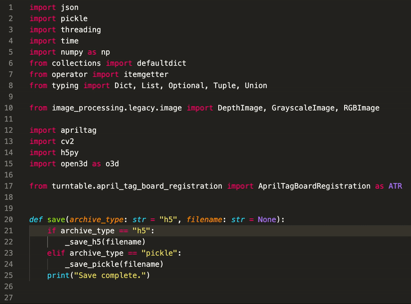

# reorder-python-imports

VSCode extension to sort and refactor python imports using
[`reorder-python-imports`](https://github.com/asottile/reorder_python_imports).

Unlike other import organizers, `reorder-python-imports` focuses on reducing the
frequency of merge conflicts, using static analysis to avoid the need for an active
venv, and providing better compatibility with `pre-commit` and `black`.

To learn more,
[visit the original tool's homepage](https://github.com/asottile/reorder_python_imports).

## Features

Refactoring the imports is provided as a code action, which can be invoked by right
clicking on the code or the lightbulb icon and selecting `Reorder Imports`, or
selecting `Python Refactor: Reorder Imports` from the command palette.



## Settings

Below is an example of a [settings.json](https://code.visualstudio.com/Docs/customization/userandworkspace) file with settings relevant to
vscode-reorder-python-imports.

```json
{
    "reorder-python-imports.args": [
        "--application-directories=.:src",
        "--add-import 'from __future__ import absolute_import'",
        "--add-import 'from __future__ import division'",
        "--add-import 'from __future__ import print_function'"
    ]
}
```

### Reordering on Save

Reordering imports on save is also supported, but requires you to set the following in
your settings to prevent Microsoft's python extension from running `isort`:

```json
{
    "[python]": {
        "editor.codeActionsOnSave": {
            "source.organizeImports": "never",
            "source.organizeImports.reorder-python-imports": "explicit"
        }
    }
}
```

Use `"always"` instead of `"explicit"` if you also want imports reordered when
the file is auto-saved on a window or focus change. VS Code deprecated the
boolean form of these values in 1.83 — `true` became `"explicit"` and `false`
became `"never"`.

## Requirements

`reorder-python-imports` must be installed in the interpreter selected by the
Python extension, or its path must be set in settings.

It is looked up in this order:

1. `reorderPythonImports.path`, if set. A relative path is resolved against the
   workspace folder, and a leading `~` against your home directory.
2. The console script of the selected interpreter — beside the interpreter
   itself, then in the environment's scripts directory. The second location is
   what conda environments need, since they keep the interpreter at the
   environment root and the scripts under `Scripts`.
3. Failing both, `python -m reorder_python_imports`, which works wherever the
   package is importable even if no console script was ever generated.

## Troubleshooting

Diagnostics are written to the `reorder-python-imports` output channel (`View` →
`Output`, then pick it from the dropdown). Set its level to `Debug` with
`Developer: Set Log Level…` to see the resolved executable, the arguments it was
given, and the edit that was applied.

Because it runs an executable resolved from workspace settings, the extension
requires a [trusted workspace](https://code.visualstudio.com/docs/editor/workspace-trust)
and stays inactive in Restricted Mode.

## Known Issues

`isort` from Microsoft's Python Extension also provides a code action for organizing
imports. When vscode is configured to organize imports on save, both `isort` and
`reorder-python-imports` are run. To work around this, see the [reordering on save](#reordering-on-save) section.

## Development

`npm test` compiles, lints and runs the unit tests; `npm run package` produces a
VSIX. The extension icon is generated from its source with `npm run icon`, which
needs `rsvg-convert` (librsvg) on `PATH`.

### The two TypeScript packages

`devDependencies` deliberately holds TypeScript twice:

| Package                                   | Version | Used by                              |
| ----------------------------------------- | ------- | ------------------------------------ |
| `typescript-next` (alias of `typescript`) | 7.x     | `npm run compile` — the actual build |
| `typescript`                              | 6.x     | typescript-eslint only               |

typescript-eslint refuses to load against TypeScript 7 — not merely a stale peer
range, but an explicit check in the parser — and its `typescript` peer is
resolved from the root of the tree, so the root copy has to stay on 6.x for
`npm run lint` to work at all. `npm overrides` cannot nest a different copy
underneath it.

Do not "tidy" this by deleting `typescript-next` or by bumping `typescript` to
7.x: the first drops the build back to the older compiler, and the second breaks
linting. Both packages can be collapsed back into one once typescript-eslint
supports TypeScript 7 — tracked in
[typescript-eslint#10940](https://github.com/typescript-eslint/typescript-eslint/issues/10940).

## Releasing a new version

Use `npm version` with either `major`, `minor` or `patch` to both bump the
version in `package.json` and create a git version tag. The extension is
published to the VS Code Extension Marketplace using GitHub Actions.

### Releasing a pre-release

This needs to be done outside CI/CD. The following command bumps the minor part
of the version (in `package.json` and with a git tag) and publishes the
extension as a [pre-release](https://code.visualstudio.com/api/working-with-extensions/publishing-extension#prerelease-extensions).

```bash
npx vsce publish minor --pre-release
```
